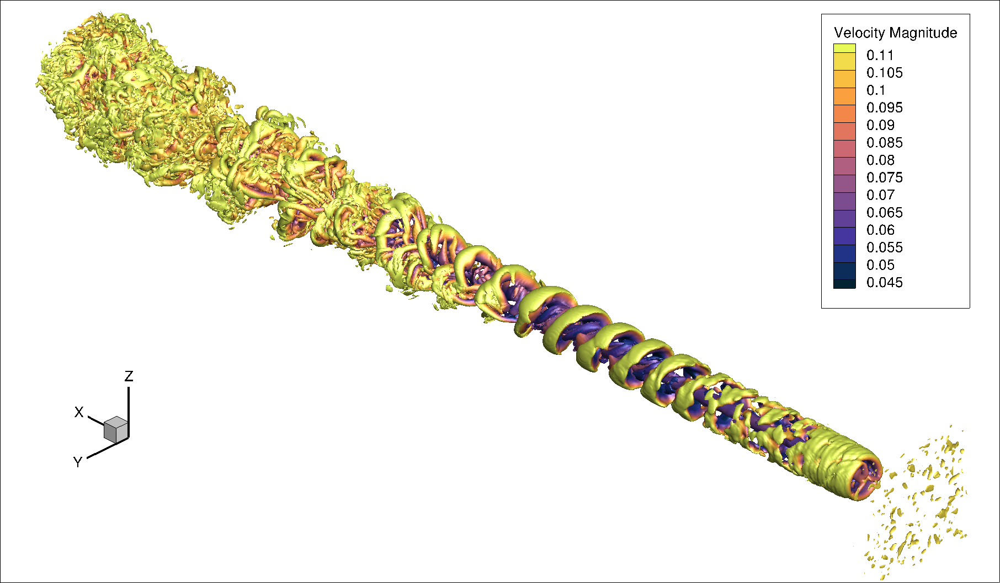
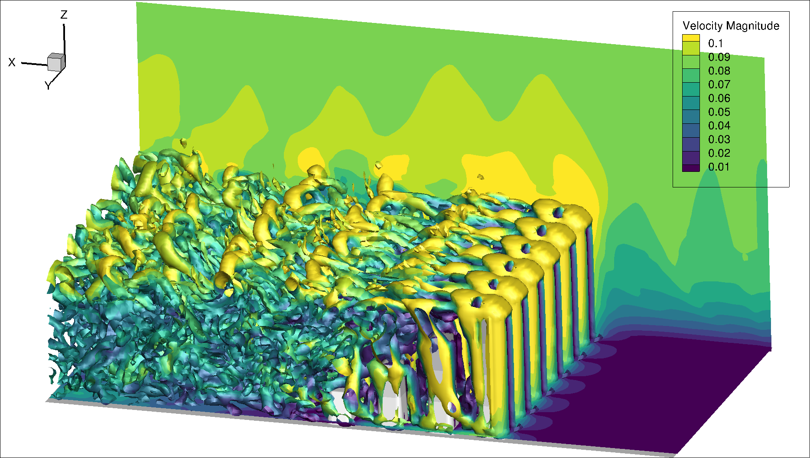
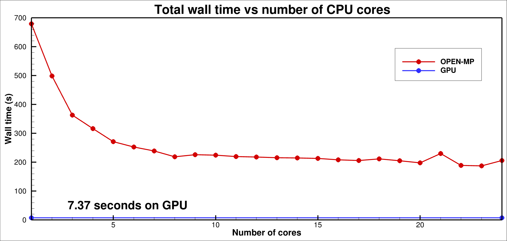

# Lattice-Boltzmann-Model
This repository contains a 3D implementation of a Lattice-Boltzmann model on a D3Q19 or D3Q27 lattice for high Reynolds number flow.

## Relese notes:
**The latest pushes have been major upgrades. Speedup is now around 100 on GPU relative a single CPU core.**
  - The code uses pointers to switch beteen f1 and f2 every second timestep. This allows for a significant simplification
    for the implementation of boundary conditions and reduces the load on the GPU for the postcoll routine.
  - postcoll now replaces fequil2, regularization, vreman and collisions, which are all done in one common kernel.
  - The actuatorline model was a mess, and I have now cleaned it up and tested it again.
  - I have changed the format of the infile.in. Also, if there is no infile.in present, Boltzmann will generate one for you.
  - I have developed a relatively robust test environment. If you activate ltesting in infile.in the code will dump the whole distribution function 
    f in a file at the end of the simulation e.g., testing000200.uf if you run 200 time-steps. All subsequent 200 time-steps runs will then compute the
    difference between the latest simulations and the reference testing000200.uf file. A tolerance of (RMSE=0.1E-06 and MAXERR=0.1E-05) are acceptable.

## License

This project is dual-licensed to accommodate both academic/research and commercial use:

1. **Academic / Research License**
   - Free for non-commercial academic and research purposes.
   - Based on [Apache License 2.0](LICENSE-APACHE.txt) terms (with non-commercial restriction).
   - See [LICENSE-Academic.txt](LICENSE-Academic.txt) for full details.
   - **Commercial use is not permitted under this license.**

2. **Commercial / Proprietary License**
   - Required for any commercial, proprietary, or for-profit use.
   - See [LICENSE-Commercial.txt](LICENSE-Commercial.txt) for details.
   - To obtain a commercial license, please contact: [Geir Evensen] – [geir.evensen@gmail.com]


**Summary:**
Academic/research users can use the software freely under the Academic License.
Commercial users must obtain a commercial license before using the software in any for-profit or proprietary project.

## Introduction

The code, NVIDIA's CUDA Fortran, runs on a single core, an OPEN-MP multicore, or a GPU, with optimization primarily for the GPU.

The code runs in single precision as default but a flag copiles a double precision version.

The collision operator is a single relaxation time with relaxation to a third-order Hermite expansion of the Equilibrium distribution
similar to the approach taken by [Jacob et al (2018)](https://hal.science/hal-02114308) and
[Feng et al, (2018)](https://doi.org/10.1029/2020MS002107), but excluding the hybrid regularization using finite differences that I did not yet need.
It is also possible to use the code for viscous flow without regularization and turbulence closure, and using a second-order BGK expansion.

The turbulence closure scheme is the one described by [Vreman (2004)](https://doi.org/10.1063/1.1785131).

The model boundary conditions are periodic or inflow-outflow in the i-direction, periodic or closed no-slip or free-slip two-timestep bounceback in the j- and k-
directions.

The code allows for inserting solid bodies within the model domain to simulate, e.g., flow around an airfoil or a cylinder.

Additionally, there is a complete implementation of an actuator line model for the NREL-5Mw wind turbine, and it is possible to include multiple
turbines at any location of the model domain.

Inflow turbulence is mimicked or introduced at a section inside the inflow boundary at i=1 (typically at the slice i=10) by applying a smooth in space
and time, pseudo-random force on the fluid.

The forcing function for the inflow turbulence and the turbines is that of Kupershtokh (2009).

Previously, for the turbine forcing, it was also possible to run with the forcing formulations of Guo et al (2002). However, when using regularization, we
project the non-equilibrium distribution onto the third-order Hermite polynomials. The significant difference between the Guo scheme's equilibrium
distribution computed on the forcing-updated velocities leads to a poor representation using Hermite polynomials, and we partly lose the effect of the
forcing.  Thus, in the Guo scheme with regularization, it is necessary to compute the regularization first on R(fneq)=R(f-feq(u)) and then recover
f=feq(u)+R(fneq) before computing the updated forcing velocities u+du and the forcing distribution df. Next we must compute feq(u+du) and fneq(u+du)=
f-feq(u+du), which goes into the collision and vreman calls. Thus, the cost of Guo is therefore much higher as it requires two calls to fequil and an extra
computation of f=feq +R(fneq) and extra computation of fneq= f-feq(u+du). It is possible to reduce the computational cost by updating only at the turbine
locations, but for now, it is not worth the effort.


<p align="center">

</p>

<p align="center">

</p>

---

# Installation:

## 1. Building the Project

If you plan to collaborate or contribute anything to the project, use the <a href="#1b-advanced-installation">Advanced Installation</a> option.

### 1a. Basic installation

Create a directory to clone the three following repositories:

```bash
git clone git@github.com:geirev/LBM.git
```

### 1b. Advanced installation

   - Make a personal github account unless you already have one.
   - Fork the LBM repository.
   - Next clone the forked repositories where you need to replace <userid> with your github userid.
   - Set upstream to the original repositories.

```bash
git clone git@github.com:<userid>/LBM.git
pushd LBM
git remote add upstream git://github.com:geirev/LBM
popd
```
or, if you have not set up git-ssh (or see instructions below)
```bash
git clone git@github.com:<userid>/LBM.git
pushd LBM
git remote add upstream https://github.com/geirev/LBM
```

If you are new to Git, read the section <a href="#git-instructions">Git instructions</a>

## 2. Required Packages

### Linux

```bash
sudo apt-get -y update
sudo apt-get -y install libfftw3-dev  # fft library used when sampling pseudo-random fields
```

nvidia Cuda fortran compiler and utilities installation (get the latest version, nvhpc-25-7 is just for illustration).
```bash
curl https://developer.download.nvidia.com/hpc-sdk/ubuntu/DEB-GPG-KEY-NVIDIA-HPC-SDK | sudo gpg --dearmor -o /usr/share/keyrings/nvidia-hpcsdk-archive-keyring.gpg
echo 'deb [signed-by=/usr/share/keyrings/nvidia-hpcsdk-archive-keyring.gpg] https://developer.download.nvidia.com/hpc-sdk/ubuntu/amd64 /' | sudo tee /etc/apt/sources.list.d/nvhpc.list
sudo apt-get update -y
sudo apt-get install -y nvhpc-25-7
sudo apt install nvidia-cuda-toolkit
```

In addition you can use netcdf for output and if you wish using netcdf you must then install it on your system.
```bash
sudo apt install netcdf-bin libnetcdf-dev libnetcdff-dev
```
In case of problems you can use the included installation script with manual compilation:
```bash
./bin/install_netcdf.sh
```

## 3. Compile the `LBM` code

For gpu compilation run 'nvidia-smi' or 'lshw -C display' to find you gpu-card.
Then check the compute capability of your gpu in the table
[https://developer.nvidia.com/cuda-gpus](https://developer.nvidia.com/cuda-gpus).
Note also the link to the old/legacy GPU cards in the link 
[https://developer.nvidia.com/cuda-legacy-gpus] (https://developer.nvidia.com/cuda-legacy-gpus), and also be aware that some old GPU cards
may require you to install older versions than nvhpc-25-7.

Navigate to the `src` folder and open the makefile and specify the correct -gpu=ccXX flag.
```bash
cd LBM/src
vi makefile
```

Typically you will only need to edit the file `mod_dimensions.F90` to set the grid dimensions before compilations.

Then compile and install the executable in the target directory, defaulting to
`$HOME/bin` so make sure `$HOME/bin` exists and is included in your path:

Default is compilation for single core in single precision on D3Q27 lattice using nvfortran/pgf90.
```bash
make -B
```
where the `-B` option force compilation from scratch.

When running on a single core or using OPEN-MP, gfortran generates a faster executable than nvfortran, so use
```bash
make -B GFORTRAN=1
```
to generate an executable for a single core in single precision on D3Q27 lattice using gfortran.

Similarly to compile for OPEN-MP in single precision on D3Q27 lattice using gfortran
```bash
make -B GFORTRAN=1 MP=1
```

nvfortran compilation for single core in single precision on D3Q19 lattice
```bash
make -B D3Q19=1
```

nvfortran compilation for OPEN-MP in single precision on D3Q27 lattice
```bash
make -B MP=1
```

nvfortran compilation for CUDA GPU in single precision and D3Q27 lattice
```bash
make -B CUDA=1
```

Compilation for CUDA GPU in double precision and D3Q27 lattice
```bash
make -B DP=1 CUDA=1
```

To recompile from scratch add a -B flag. (Necessary if you change in between parallelization settings like CUDA or OPEN-MP).

E.g., recomile for GPU in double precision using D3Q19 lattice
```bash
make -B CUDA=1 DP=1 D3Q19=1
```

To compile and link the netcdf library you compile as
```bash
make -B CUDA=1 NETCDF=1
```
Some editing of paths to NETCDF libraries etc in the makefile might be necessary.

Running in single precision is about 3 faster than using double precision.

Running on the D3Q19 lattice reduces the CPU time with around 40 % but seems to introduce some noise for high Reynolds number flow.

A test running 200 time steps on single CPU, with OPEN-MP, and GPU for a domain of 121x121x928 gave the following wall times:

```bash
single-core     (gfortran)  :  753.83 s   (make -B GFORTRAN=1)
single-core     (nvfortran) : 1096.98 s   (make -B)
open-mp 18 cores (nvfortran):  176.39 s   (make -B MP=1)
open-mp 24 cores (gfortran) :  140.07 s   (make -B GFORTRAN=1 MP=1)
GPU             (nvfortran) :    7.00 s   (make -B CUDA=1)
```
The simulations were run on a "Lenovo Legion 7 Pro" laptop with a "Core Ultra 9 275 HX" (having 24 independent cores)
and the gpu card is "Nvidia RTX 5090."


<p align="center">

</p>

This plot clearly shows that GPU is the optimal choice for heavy simulations, while CPU scaling beyond 10-16 cores is inefficient.
Also, for single core and OPEN-MP gfortran is faster than nvfortran with the compiler flags currently used.

## 4. Run the code

Start by defining the required grid dimensions in the src/mod_dimensions.F90 file, and compile.

Create a separate catalog preferably on a large scratch disk or work area, e.g.,
```bash
mkdir rundir
cd cd rundir
ulimit -s unlimited
boltzmann
```
The model will then generate a template `infile.in` file.
Spend some time understanding the inputs you can provide through the infile.in.

If you want to run with wind turbines, link or copy the `Airfoils` directory to the rundir and
define a number of turbines larger than 0 with their grid locations at the bottom of the `infile.in`.

The example infile.in corresponds to a  2D city case with flow through the city, and the program should run without any other input files. Just choose
the city2 case in mod_dimensions.F90. You can also use this grid for the cylinder case by changing `city2` to `cyliner` in the infile.in.
For more realistic 3D runs increase the number of vertical grid points.

The example/run.sh script may be required for large grids, as it sets ulimit -s unlimited and it also defines the number of cores used in OPEN-MP simuilations.

The example/uvel.orig file defines an atmospheric boundary layer if it is found in the run direcotry.

In summary to execute the code on a single core:
```bash
ulimit -s unlimited
boltzmann
```

To run the code on 18 cores using OPEN-MP:
```bash
export OMP_NUM_THREADS=18
ulimit -s unlimited
boltzmann
```

To run on the GPU it's just:
```bash
boltzmann
```

## 5. Code profiling
To profile the code run, e.g.,
```bash
nsys profile --stats=true boltzmann
```
or on prehistoric GPU architectures
```bash
nvprof boltzmann
```
which gives a detailed listing of the CPU time used by each kernel.

To obtain more realistic profiling, removing the device to host copying which starts dominating for short GPU runs, set
`lnodump` to `true` and  `ltiming` to `false` in `infile.in`. This avoids writing dianostic and restart files and 
eliminates all the syncs before and after kernal lauches which the profiling
reacts on but which has little impact on the total simulation time.


## 6. Plotting

The current code version outputs Tecplot plt files read by tec360.

The plotting routine is m_diag.F90 that dumpis a file tecGRID.plt containing the grid layout, i.e., the i, j, and k indices and the blanking variable.
For each solution time the routine saves the density and three velocity components in each grid point.
When using Tecplot one must load the tecGRID.plt file as the first file and add any number of solution files.
Thus, the diagnostic saved is minimal, and we compute absolute velocity and vorticity, and Q-criterion diagnostics within Tecplot using the loaded velocity
fields.

Additionally, it is possible to compute the averages over any number of time-steps and these are then saved to tecAVERAGE.plt. This file also contains the
turbulent kinetic energy.

An alternative to Tecplot is the open-source program Paraview which also reads Tecplot files. However ensure that the option `tecout` is set to `0` to dump
full Tecplot files.

Note also the option to output netcdf files by setting `tecout` to `3` in `infile.in` and compiling with NEDCDF=1.


---

## 7. Code standards

If you plan to change the code note the following:

I always define subroutines in new modules:

```Fortran90
module m_name_of_subroutine
! define global variables here
contains
subroutine name_of_subroutine
! define local variables here
...
end subroutine
end module
```

in the main program you write

```Fortran90
program name
use m_name_of_subroutine
call  name_of_subroutine
end program
```

The main program then has access to all the global variables defined in the module, and
knows the header of the subroutine and the compiler checks the consistency between the call
and the subroutine definition.

make new -> updates the dependencies for the makefile
make tags -> runs ctags (useful if you use vim)

The current makefile updates the dependencies at every compilation, so if you add a file with a new subroutine you can just type make and it will be included
in the compilation.

For this to work install the scripts in the ./bin in your path and install ctags

---

## 7. Git instructions

When working with git repositories other than the ones you own, and when you expect to contribute to the code,
a good way got organize your git project is described in https://opensource.com/article/19/7/create-pull-request-github
This link is also a good read: <a href="https://dev.to/valeriavg/main-git-in-7-minutes-gai">Git tutorial</a>

This organization will allow you to make changes and suggest them to be taken into the original code through a pull request.

So, you need a github account.
Then you fork the repository to your account (make your personal copy of it) (fork button on github.com).
This you clone to your local system where you can compile and run.

```bash
git clone https://github.com/<YourUserName>/EnKF_seir
git remote add upstream https://github.com/geirev/EnKF_seir
git remote add origin git@github.com:<YourUserName>/EnKF_seir
git remote -v                   #   should list both your local and remote repository
```

To keep your local main branch up to date with the upstream code (my original repository)

```bash
git switch main             #   unless you are not already there
git fetch upstream              #   get info about upstream repo
git merge upstream/main       #   merges upstream main with your local main
```

If you want to make changes to the code:

```bash
git switch -c branchname      #   Makes a new branch and moves to it
```

Make your changes

```bash
git add .                       #   In the root of your repo, stage for commit
git status                      #   Tells you status
git commit                      #   Commits your changes to the local repo
```

Push to your remote origin repo

```bash
git push -u origin branchname   #   FIRST TIME to create the branch on the remote origin
git push                        #   Thereafter: push your local changes to your forked  origin repo
```

To make a pull request:

1. Commit your changes on the local branch

```bash
git add .                       #   In the root of your repo, stage for commit
git status                      #   Tells you status
git commit -m"Commit message"   #   Commits your changes to the local repo
git commit --amend              #   Add changes to prevous commit
git push --force                #   If using --amend and previous commit was pushed
```

2. Update the branch where you are working to be consistent with the upstream main

```bash
git switch main             #   unless you are not already there
git fetch upstream              #   get info about upstream repo
git merge upstream/main       #   merges upstream main with your local main
git switch brancname          #   back to your local branch
git rebase main               #   your branch is updated by adding your local changes to the updated main
```

3. squash commits into one (if you have many commits)

```bash
git log                      #   lists commits
git rebase -i indexofcommit  #   index of commit before your first commit
```

Change pick to squash for all commits except the latest one.
save and then make a new unified commit message.

```bash
git push --force             #   force push branch to origin
```

4. open github.com, chose your branch, make pullrequest, check that there are no conflicts

Then we are all synced.

If you manage all this you are a git guru.
Every time you need to know something just search for git "how to do something" and there are tons of examples out there.

For advanced users:
Set the sshkey so you don't have to write a passwd everytime you push to your remote repo: check settings / keys tab
Follow instructions in
https://help.github.com/en/github/using-git/changing-a-remotes-url

To make your Linux terminal show you the current branch in the prompt include the follwoing in your .bashrc

```bash
parse_git_branch() {
     git branch 2> /dev/null | sed -e '/^[^*]/d' -e 's/* \(.*\)/(\1)/'
}
export PS1="\[\033[01;32m\]\u@\h\[\033[00m\]:\[\033[1;31m\]\w\[\033[0;93m\]\$(parse_git_branch)\[\033[0;97m\]\$ "
```
---
