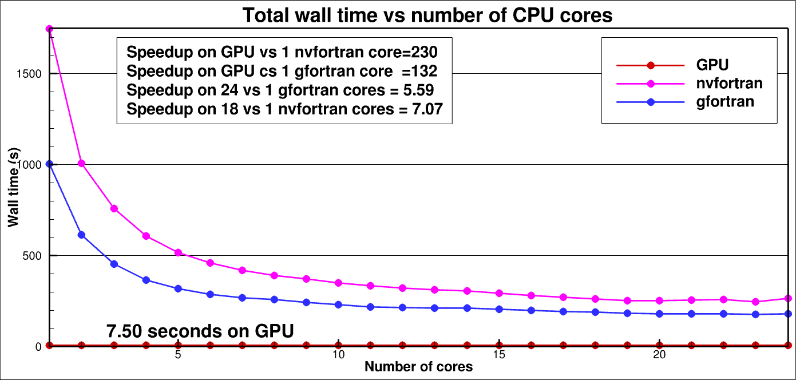
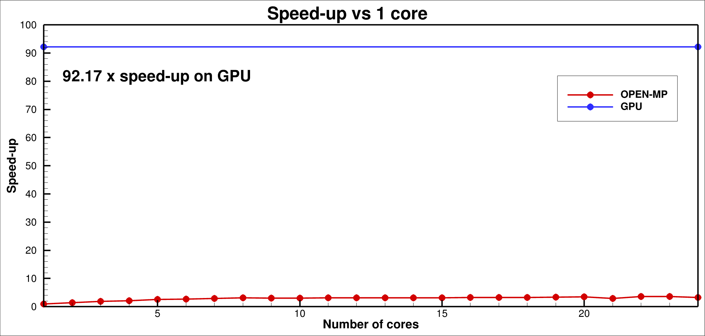

# Lattice-Boltzmann-Model
This repository contains a 3D implementation of a Lattice-Boltzmann model on a D3Q19 or D3Q27 lattice for high Reynolds number flow.

## License

This project is dual-licensed to accommodate both academic/research and commercial use:

1. **Academic / Research License**
   - Free for non-commercial academic and research purposes.
   - Based on [Apache License 2.0](LICENSE-APACHE.txt) terms (with non-commercial restriction).
   - See [LICENSE-Academic.txt](LICENSE-Academic.txt) for full details.
   - **Commercial use is not permitted under this license.**

2. **Commercial / Proprietary License**
   - Required for any commercial, proprietary, or for-profit use.
   - See [LICENSE-Commercial.txt](LICENSE-Commercial.txt) for details.
   - To obtain a commercial license, please contact: [Geir Evensen] – [geir.evensen@gmail.com]


**Summary:**
Academic/research users can use the software freely under the Academic License.
Commercial users must obtain a commercial license before using the software in any for-profit or proprietary project.

## Introduction

The code, NVIDIA's CUDA Fortran, runs on a single core, an OPEN-MP multicore, or a GPU, with optimization primarily for the GPU.

The code runs in single precision as default but a flag copiles a double precision version.

The collision operator is a single relaxation time third-order expansion with regularization similar to [Jacob et al (2018)](https://hal.science/hal-02114308) and
[Feng et al, (2018)](https://doi.org/10.1029/2020MS002107), but excluding the hybrid regularization, which I have not yet needed. It is also possible to use it for
viscous flow without regularization and turbulence closure, and using a second-order BGK expansion.

The turbulence closure scheme is the one described by [Vreman (2004)](https://doi.org/10.1063/1.1785131).

The model boundary conditions are periodic or inflow-outflow in the i-direction, periodic or closed no-slip or free-slip two-timestep bounceback in the j- and k-
directions.

The code allows for inserting solid bodies within the model domain to simulate, e.g., flow around an airfoil or a cylinder.

Additionally, there is a complete implementation of an actuator line model for the NREL-5Mw wind turbine, and it is possible to include multiple
turbines at any location of the model domain.

Inflow turbulence is mimicked or introduced at a section inside the inflow boundary at i=1 (typically at the slice i=10) by applying a smooth in space
and time, pseudo-random force on the fluid.

The forcing function for the inflow turbulence and the turbines is that of Kupershtokh (2009). For the turbine forcing, it is also possible to run with the forcing
formulations of Guo et al (2002). However, when using regularization, we project the non-equilibrium distribution onto the third-order Hermite polynomials. The
significant difference between the Guo scheme's equilibrium distribution computed on the forcing-updated velocities leads to a poor representation using Hermite
polynomials, and we partly lose the effect of the forcing. Thus, in the Guo scheme with regularization, it is necessary to compute the regularization first on
R(fneq)=R(f-feq(u)) and then recover f=feq(u)+R(fneq) before computing the updated forcing velocities u+du and the forcing distribution df. Next we compute
feq(u+du) and fneq(u+du)= f-feq(u+du), which goes into the collision and vreman calls. Thus, the cost of Guo is therefore much higher as it requires two calls to
fequil and an extra computation of f=feq +R(fneq) and extra computation of fneq= f-feq(u+du). It is possible to reduce the computational cost by updating only at
the turbine locations, but for now, it is not worth the effort.


<p align="center">

</p>

<p align="center">

</p>

---

# Installation:

## 1. Building the Project

If you plan to collaborate or contribute anything to the project, use the <a href="#1b-advanced-installation">Advanced Installation</a> option.

### 1a. Basic installation

Create a directory to clone the three following repositories:

```bash
git clone git@github.com:geirev/LBM.git
```

### 1b. Advanced installation

Make a personal github account unless you already have one.
Fork the LBM repository.
Next clone the forked repositories and set upstream to the original repositories where
you need to replace <userid> with your github userid

```bash
git clone git@github.com:<userid>/LBM.git
pushd LBM
git remote add upstream git://github.com:geirev/LBM
popd
```
or, if you have not set up git-ssh
```bash
git clone git@github.com:<userid>/LBM.git
pushd LBM
git remote add upstream https://github.com/geirev/LBM
```

If you are new to Git, read the section <a href="#git-instructions">Git instructions</a>

## 2. Required Packages

### Linux

```bash
sudo apt-get -y update
sudo apt-get -y install libfftw3-dev               # fft library used when sampling pseudo-random fields

# nvidia Cuda fortran compiler and utilities installation (get the latest version, nvhpc-25-7 is just for illustration).
curl https://developer.download.nvidia.com/hpc-sdk/ubuntu/DEB-GPG-KEY-NVIDIA-HPC-SDK | sudo gpg --dearmor -o /usr/share/keyrings/nvidia-hpcsdk-archive-keyring.gpg
echo 'deb [signed-by=/usr/share/keyrings/nvidia-hpcsdk-archive-keyring.gpg] https://developer.download.nvidia.com/hpc-sdk/ubuntu/amd64 /' | sudo tee /etc/apt/sources.list.d/nvhpc.list
sudo apt-get update -y
sudo apt-get install -y nvhpc-25-7
sudo apt install nvidia-cuda-toolkit
```

## 3. Compile the `LBM` code

For gpu compilation run 'nvidia-smi' or 'lshw -C display' to find you gpu-card.
The check the compute capability of your gpu in the table https://developer.nvidia.com/cuda-gpus.
Navigate to the `src` folder and open the makefile and specify the correct -gpu=ccXX flag.


```bash
cd LBM/src
```

then compile and install the executable in the target directory, defaulting to
`$HOME/bin`:

Default is compilation for single core in single precision on D3Q27 lattice.
```bash
make -B
```

Default is compilation for single core in single precision on D3Q27 lattice using gfortran.
```bash
make -B GFORTRAN=1
```

Default is compilation for OPEN-MP in single precision on D3Q27 lattice using gfortran.
```bash
make -B GFORTRAN=1 MP=1
```

Compilation for single core in single precision on D3Q19 lattice
```bash
make -B D3Q19=1
```

Compilation for OPEN-MP in single precision on D3Q27 lattice
```bash
make -B MP=1
```

Compilation for CUDA GPU in single precision and D3Q27 lattice
```bash
make -B CUDA=1
```

Compilation for CUDA GPU in double precision and D3Q27 lattice
```bash
make -B DP=1 CUDA=1
```

To recompile from scratch add a -B flag. (Necessary if you change in between parallelization settings like CUDA or OPEN-MP).

E.g., recomile for GPU in double precision using D3Q19 lattice
```bash
make -B CUDA=1 DP=1 D3Q19=1
```

Running in single precision is about twice as fast as using double precision.

Running on the D3Q19 lattice reduces the CPU time with around 40 % but seems to introduce more noise.

A test running 200 time steps on single CPU, with OPEN-MP, and GPU for a domain of 121x121x928 gave the following wall times:

```bash
single-core     (gfortran)  : 915.84 s   (make -B GFORTRAN=1)
single-core     (nvfortran) : 641.48 s   (make -B)

open-mp 6 cores (gfortran)  : 295.57 s   (make -B GFORTRAN=1 MP=1)

open-mp 6 cores (nvfortran) : 244.28 s   (make -B MP=1)
open-mp 13 cores (nvfortran): 204.78 s   (make -B MP=1)
open-mp 16 cores (nvfortran): 202.78 s   (make -B MP=1)
open-mp 24 cores (nvfortran): 253.74 s   (make -B MP=1)

GPU             (nvfortran) :  36.12 s   (make -B CUDA=1)
```
The simulations were run on a "Lenovo Legion 7 Pro" laptop with a "Core Ultra 9 275 HX" (having 24 indepenent cores) and the gpu card is "Nvidia RTX 5090."


<p align="center">

</p>
<p align="center">

</p>

These plots clearly show that GPU is the optimal choice for heavy simulations, while CPU scaling beyond 10-16 cores is inefficient.

For the GPU simultion the timing of different routines were as follows after a first optimization pass doing the standards:


```bash
------------------------------------------------------------------------------------------------
                           gfortran nvfortran   nvfortran    nvidia     Speedup
                             1 core    1 core    10 cores       GPU    core/GPU
------------------------------------------------------------------------------------------------
initialization     time =   0.57         0.74        0.76     0.741       1.00x
turbine forcing    time =   9.16         5.23        2.21     0.485      10.80x
turbulence forcing time =   0.82         0.48        0.15     0.031      15.50x
equil              time = 395.67       197.72       72.33     1.700     116.30x
regularization     time = 347.00       217.11       70.63     1.949     111.40x
vreman             time =  89.41       102.16       23.09     0.726     140.70x
collisions         time =  23.26        30.73       11.78     2.409      12.80x
applyturbines      time =   0.48         0.37        0.54     0.046       8.00x
applyturbulence    time =   0.06         0.06        0.08     0.007       8.60x
solids             time =   0.00         0.00        0.00     0.000       ---
boundarycond       time =   1.64         1.69        1.07     0.588       2.90x
drift              time =  45.75        45.03       19.98     2.074      21.70x
macrovars          time =  19.75        22.02        6.10     0.607      36.30x
diag               time =   1.54         2.04        2.15     2.052       1.00x
final stuff        time =   1.30         1.21        1.32     1.342       0.90x
compute_f(neq)     time =  23.13        19.54       10.87     1.687      11.60x
Total wall time    time = 959.78       646.42      223.33    16.657      38.80x (52.1x)
------------------------------------------------------------------------------------------------
```

The total speedup is 52.1x if neglecting initalization and saving diagnostics.

DP-GPU is aboutn 2.5 times slower than SP-GPU.

Optimization should now continue on collisions, drift, and computefneq.


## 4. Run the code

Start by defining the required grid dimensions in the src/mod_dimensions.F90 file, and compile.

Create a separate catalog preferably on a large scratch disk or work area, and copy the example/infile.in to this catalog.
The example infile.in corresponds to a  2D city case with flow through the city, and the program should run without any other input files. Just choose
the city2 case in mod_dimensions.F90. You can also use this grid for the cylinder case by editing the infile.in. For more realistic 3D runs increase the
vertical resolution.

The example/run.sh script may be required for large grids, as it sets ulimit -s unlimited and it also defines the number of cores used in OPEN-MP simuilations.

The example/uvel.orig file defines an atmospheric boundary layer if it is found in the run direcotry.

To execute the code run:

```bash
boltzmann
```

## 5. Code profiling
To profile the code run, e.g.,
```bash
nsys profile --stats=true boltzmann
```
or on prehistruc GPU architectures
```bash
nvprof boltzmann
```
which gives a detailed listing of the CPU time used by each kernel.
It is clear that the third order expansion and the regularization are by far the most expensive computations in the code.


## 6. Plotting

The current code version outputs Tecplot plt files read by tec360.

The plotting routine is m_diag.F90 that dumpis a file tecGRID.plt containing the grid layout, i.e., the i, j, and k indices and the blanking variable.
For each solution time the routine saves the density and three velocity components in each grid point.
When using Tecplot one must load the tecGRID.plt file as the first file and add any number of solution files.
Thus, the diagnostic saved is minimal, and we compute absolute velocity and vorticity, and Q-criterion diagnostics within Tecplot using the loaded velocity
fields.

Additionally, it is possible to compute the averages over any number of time-steps and these are then saved to tecAVERAGE.plt. This file also contains the
turbulent kinetic energy.

If you are not using Tecplot you can chose another output format by replacing the call to the tecout routine in m_diag.F90 to your choice.

---

## 7. Code standards

If you plan to change the code note the following:

I always define subroutines in new modules:

```Fortran90
module m_name_of_subroutine
! define global variables here
contains
subroutine name_of_subroutine
! define local variables here
...
end subroutine
end module
```

in the main program you write

```Fortran90
program name
use m_name_of_subroutine
call  name_of_subroutine
end program
```

The main program then has access to all the global variables defined in the module, and
knows the header of the subroutine and the compiler checks the consistency between the call
and the subroutine definition.

make new -> updates the dependencies for the makefile
make tags -> runs ctags (useful if you use vim)

The current makefile updates the dependencies at every compilation, so if you add a file with a new subroutine you can just type make and it will be included
in the compilation.

For this to work install the scripts in the ./bin in your path and install ctags

---

## 7. Git instructions

When working with git repositories other than the ones you own, and when you expect to contribute to the code,
a good way got organize your git project is described in https://opensource.com/article/19/7/create-pull-request-github
This link is also a good read: <a href="https://dev.to/valeriavg/main-git-in-7-minutes-gai">Git tutorial</a>

This organization will allow you to make changes and suggest them to be taken into the original code through a pull request.

So, you need a github account.
Then you fork the repository to your account (make your personal copy of it) (fork button on github.com).
This you clone to your local system where you can compile and run.

```bash
git clone https://github.com/<YourUserName>/EnKF_seir
git remote add upstream https://github.com/geirev/EnKF_seir
git remote add origin git@github.com:<YourUserName>/EnKF_seir
git remote -v                   #   should list both your local and remote repository
```

To keep your local main branch up to date with the upstream code (my original repository)

```bash
git switch main             #   unless you are not already there
git fetch upstream              #   get info about upstream repo
git merge upstream/main       #   merges upstream main with your local main
```

If you want to make changes to the code:

```bash
git switch -c branchname      #   Makes a new branch and moves to it
```

Make your changes

```bash
git add .                       #   In the root of your repo, stage for commit
git status                      #   Tells you status
git commit                      #   Commits your changes to the local repo
```

Push to your remote origin repo

```bash
git push -u origin branchname   #   FIRST TIME to create the branch on the remote origin
git push                        #   Thereafter: push your local changes to your forked  origin repo
```

To make a pull request:

1. Commit your changes on the local branch

```bash
git add .                       #   In the root of your repo, stage for commit
git status                      #   Tells you status
git commit -m"Commit message"   #   Commits your changes to the local repo
git commit --amend              #   Add changes to prevous commit
git push --force                #   If using --amend and previous commit was pushed
```

2. Update the branch where you are working to be consistent with the upstream main

```bash
git switch main             #   unless you are not already there
git fetch upstream              #   get info about upstream repo
git merge upstream/main       #   merges upstream main with your local main
git switch brancname          #   back to your local branch
git rebase main               #   your branch is updated by adding your local changes to the updated main
```

3. squash commits into one (if you have many commits)

```bash
git log                      #   lists commits
git rebase -i indexofcommit  #   index of commit before your first commit
```

Change pick to squash for all commits except the latest one.
save and then make a new unified commit message.

```bash
git push --force             #   force push branch to origin
```

4. open github.com, chose your branch, make pullrequest, check that there are no conflicts

Then we are all synced.

If you manage all this you are a git guru.
Every time you need to know something just search for git "how to do something" and there are tons of examples out there.

For advanced users:
Set the sshkey so you don't have to write a passwd everytime you push to your remote repo: check settings / keys tab
Follow instructions in
https://help.github.com/en/github/using-git/changing-a-remotes-url

To make your Linux terminal show you the current branch in the prompt include the follwoing in your .bashrc

```bash
parse_git_branch() {
     git branch 2> /dev/null | sed -e '/^[^*]/d' -e 's/* \(.*\)/(\1)/'
}
export PS1="\[\033[01;32m\]\u@\h\[\033[00m\]:\[\033[1;31m\]\w\[\033[0;93m\]\$(parse_git_branch)\[\033[0;97m\]\$ "
```
---
